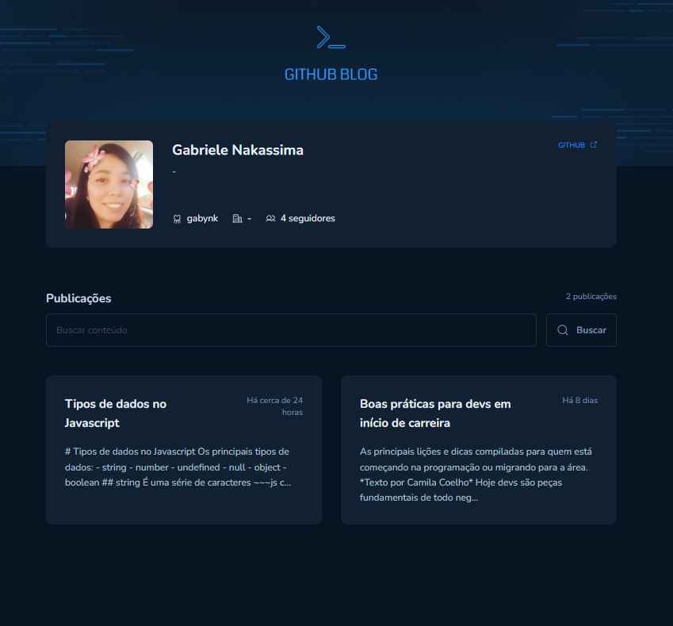
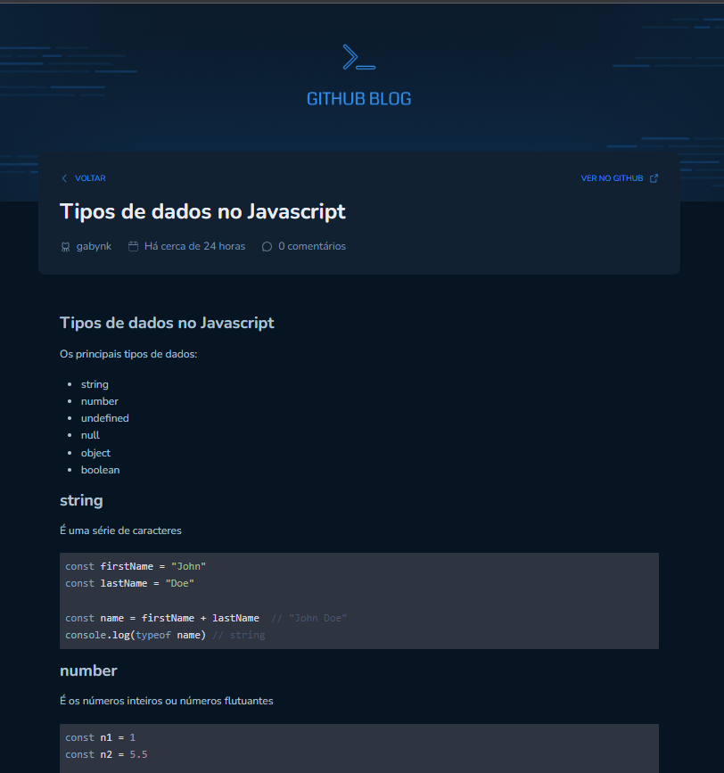

# Github blog
---

<div align="center">
 
</div>

<br><br>

## ✨💡 Functionalities 💡✨

---

<br>

This is a project about a challenge on [Rocketseat](https://www.rocketseat.com.br/). <br>

This challenge is about to create a blog where each post is an issue this repository.

- [x] Listagem do seu perfil com imagem, número de seguidores, nome e outras informações disponíveis pela API do GitHub
- [x] Listar e filtrar todas as issues do repositório com um pequeno resumo do conteúdo dela
- [x] Criar uma página para exibir um post (issue) completo
- [x] Fazer integração com Github API

<br><br>

## 🛠️ Tecnology 🛠️

---

<br>

### Frontend

- [React](https://pt-br.reactjs.org/)
- [Typescript](https://www.typescriptlang.org/)
- [Styled-components](https://styled-components.com/)
- [Hookform](https://www.react-hook-form.com/)

<br><br>

## Imagens

---

<br><br>



<br><br>


## 🎲 Getting started 🎲

---

<br>

```bash
npm install

npm run dev
```

<br><br><br>

---

<p align="center">Developed with 💜 by Gabriele Nakassima </p>